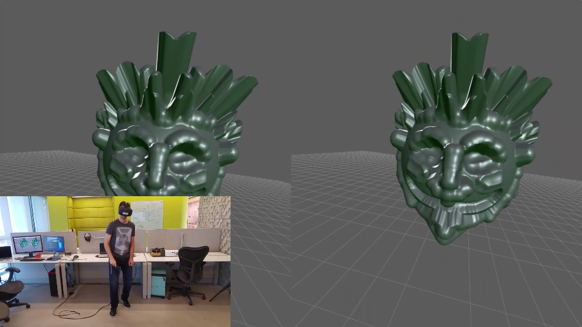

# Sculpt VR

Inspired by programs like ZBrush and Mudbox, this is a POC of a sculpting program for WebVR.

Try it [here](https://autodesk.github.io/sculpt-vr/)

Or see a [video](https://youtu.be/8FRDyrMgb6Y) of it in action.

## Requirements
* An HTC Vive
* Firefox Nightly or Chrome experimental version (get it from [webvr.info](https://webvr.info/get-chrome/)) (Chrome is a bit broken lately)

## Usage

To run the app, just serve the project's folder and open in a browser

* To carve press the trigger button.
* Pressing up/down on the touchpad will change the direction (push/pull the material).
* Pressing left/right on the touchpad will change the tool size.

## Contributing

See [CONTRIBUTING.md](CONTRIBUTING.md) for details.
